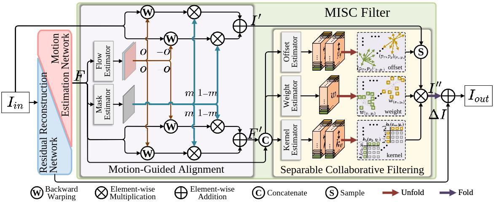

# MISCFilter
This is the official PyTorch implementation of the paper [Motion-adaptive Separable Collaborative Filters for Blind Motion Deblurring](https://).

## Contents
- [Overview](#overview)
- [Contribution](#contribution)
- [Requirements and dependencies](#requirements_and_dependencies)
- [Dataset](#dataset)
- [Models](#models)
- [Test](#test)
- [Train](#train)
- [Citation](#citation)
- [Contact](#contact)
- [Acknowledgement](#acknowledgement)

## Overview


## Contribution
* We propose a novel real-world deblurring filtering model called the Motion-adaptive Separable Collaborative (MISC) Filter. It targets the shortcomings of existing methods that focus only on image residual reconstruction in feature space and can handle more generalized and complex motion in image space.
* We analyze the relationship between the motion estimation network for producing filter parameters and the residual reconstruction network to maximize model efficiency.
* We demonstrate the effectiveness of our method by extensive quantitative and qualitative evaluations and provide an effective solution for blind motion deblurring.

## Requirements and dependencies
The model is built in PyTorch 1.8.0 (Python3.8, CUDA11.1).

For installing, follow these intructions:
```
conda create -n pytorch python=3.8
conda activate pytorch
conda install pytorch==1.8.0 torchvision==0.9.0 torchaudio==0.8.0 cudatoolkit=11.1 -c pytorch -c conda-forge
pip install matplotlib scikit-image opencv-python yacs joblib natsort h5py tqdm kornia tensorboard ptflops
```

Install warmup scheduler

```
cd pytorch-gradual-warmup-lr
python setup.py install
cd ..
```

## Dataset

### RealBlur dataset
1. Download dataset from the [RealBlur dataset](https://github.com/rimchang/RealBlur) .

2. Unzip files ```dataset``` folder.

3. Make RealBlur dataset structure be:
```
RealBlur
├─ RealBlur-J_ECC_IMCORR_centroid_itensity_ref   % 3758 train pairs, 980 test pairs
│ ├─ scene001
│ │ ├─ blur
│ │ │ ├─ blur_X.png
│ │ │ ├─ ......
│ │ ├─ gt
│ │ │ ├─ gt_X.png
│ │ │ ├─ ......
│ ├─ ......
│
├─ RealBlur-R_BM3D_ECC_IMCORR_centroid_itensity_ref   % 3758 train pairs, 980 test pairs
│ ├─ ...... (same as RealBlur-J)
│
├─ RealBlur_J_train_list.txt
├─ RealBlur_J_test_list.txt
├─ RealBlur_R_train_list.txt
├─ RealBlur_R_test_list.txt
```

### GoPro dataset
1. Download dataset from the [GoPro dataset](https://seungjunnah.github.io/Datasets/gopro.html) .

2. Unzip files ```dataset``` folder.

3. Make GoPro dataset structure be:
```
GOPRO_Large
├─ train
│ ├─ GOPRO372_07_00    % 2103 image pairs
│ │ ├─ blur
│ │ │ ├─ xxxxxx.png
│ │ │ ├─ ......
│ │ ├─ sharp
│ │ │ ├─ xxxxxx.png
│ │ │ ├─ ......
│ ├─ ......
│
├─ test    % 1111 image pairs
│ ├─ ...... (same as train)
│
├─ GOPRO_train_list.txt
├─ GOPRO_test_list.txt
```

## Models
Pre-trained models can be downloaded from [google drive](https://drive.google.com/drive/folders/1M-Sc_u97vTQskfO6VMzPghb8LnerP8Id?usp=sharing).
* *RealBlur_J.pth*: trained on RealBlur_J dataset.
* *RealBlur_R.pth*: trained on RealBlur_R dataset.
* *GoPro.pth*: trained on GoPro dataset.

## Test
1. Clone this github repo
```
git clone https://github.com/ChengxuLiu/MISCFilter.git
cd MISCFilter
```
2. Prepare testing dataset and modify "input_dir", "target_dir", and "weights" in `./test_RealBlur.py`
3. Run test
```
python test_RealBlur.py --save_result
```
4. The result are saved in `./results`
5. Modify "gt_path" and "result_path" in `./evaluate_RealBlur.py` and Run evaluate
```
python evaluate_RealBlur.py
```

## Train
1. Clone this github repo
```
git clone https://github.com/ChengxuLiu/MISCFilter.git
cd MISCFilter
```
2. Prepare training dataset and modify "train_dir" and "val_dir" in `./train_RealBlur_J.py`
3. Run training
```
python train_RealBlur_J.py
```
4. The models are saved in `./experiments`

## Citation
If you find the code and pre-trained models useful for your research, please consider citing our paper. :blush:
```
to do
``` 

## Contact
If you meet any problems, please describe them in issues or contact:
* Chengxu Liu: <liuchx97@gmail.com>

## Acknowledgement
The code of MISCFilter is built upon [DeepRFT](https://github.com/INVOKERer/DeepRFT/tree/main), [MPRNet](https://github.com/swz30/MPRNet), [MIMO-UNet](https://github.com/chosj95/MIMO-UNet/tree/main), and [AdaCoF](https://github.com/HyeongminLEE/AdaCoF-pytorch/blob/master/cupy_module/adacof.py),and we express our gratitude to these awesome projects.


